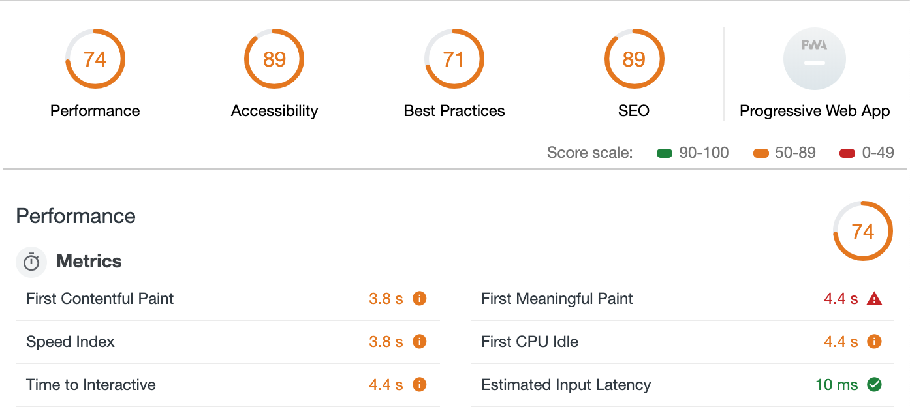
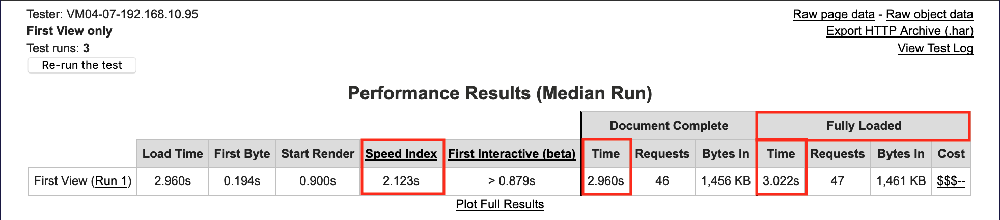
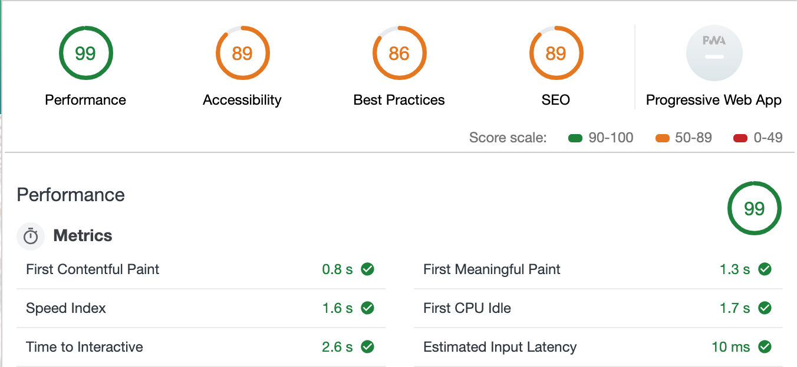
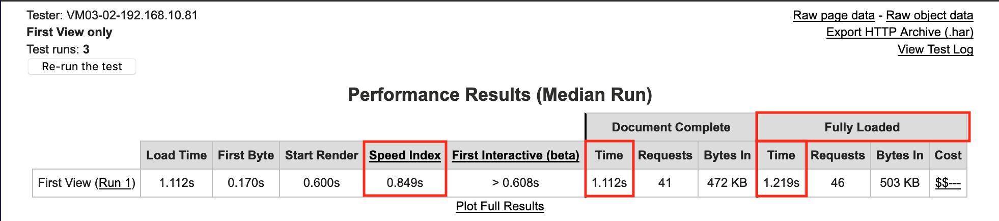

# About

This repo is a learning tool that will allow me to change existing code that is not well documented, formatted or performant into a codebase that is fast, clean and well commented. 

The project is part of Andrei Neagoie's Junior to Senior course on Udemy and will bridge the gaps in my knowledge post General Assembly SEI. 

<b>Live Link:</b> https://declanboller.github.io/keiko-corp/

# Performance

<b> Sites Used to Test Performance: </b>
  * https://developers.google.com/speed/pagespeed/insights/
  * https://www.webpagetest.org/

<b>Test Results Before:</b>

<b>Test Results After:</b>

